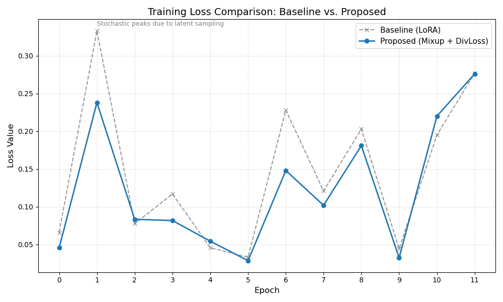

# Few-Shot Diffusion Generation via LoRA with Latent Regularization

`Python` `PyTorch` `Diffusion Models` `LoRA` `Stable Diffusion` `Generative Modeling`

Fine-tuning Stable Diffusion v1.5 on just 15 images with LoRA, and studying how to prevent the
mode collapse / memorization that extreme few-shot fine-tuning is prone to.

## Problem

Fine-tuning a large pretrained diffusion model on a tiny support set (N=15) usually causes the
model to memorize the training images rather than learn the underlying category distribution —
generated samples end up as near-copies of the training set with little variation in pose, color,
or background (mode collapse).

## Approach

Two lightweight regularizers, layered on top of standard LoRA fine-tuning:

- **Latent MixUp**: linearly interpolates between VAE latents of two support images during
  training, turning 15 discrete points into a continuous manifold the model has to generalize
  across, instead of 15 points it can memorize.
- **Diversity Loss**: an explicit penalty on the cosine similarity between predicted noise vectors
  within a training batch, pushing the model to cover more of the underlying distribution rather
  than collapsing onto a narrow mode.

Four ablation groups were trained and compared: vanilla Stable Diffusion (no fine-tuning) → LoRA
only → LoRA + Latent MixUp → LoRA + Latent MixUp + Diversity Loss (proposed).

## Results

| Group | FID ↓ | Precision ↑ | Recall ↑ |
|---|---|---|---|
| Vanilla SD (no fine-tuning) | 114.54 | 0.9800 | 0.6000 |
| LoRA only | 124.02 | **1.0000** | 0.4667 |
| LoRA + Latent MixUp | 110.94 | 0.9700 | 0.8000 |
| **LoRA + MixUp + Diversity Loss (proposed)** | **110.88** | 0.9700 | **0.8000** |

**Plain LoRA fine-tuning memorizes rather than generalizes**: it hits perfect Precision (1.0) but
Recall collapses to 0.4667 — a textbook sign of mode collapse, confirmed visually by highly
repetitive generated samples. Adding Latent MixUp recovers most of the lost diversity (Recall
0.47 → 0.80, a 74% relative improvement) essentially for free, since it only touches the data
augmentation, not the loss. The Diversity Loss then gives a small further refinement in FID without
trading away precision — evidence that most of the diversity gain comes from the data-side
augmentation, with the loss-side penalty acting as a fine-grained cleanup on top.

The proposed method's training loss also decays more smoothly than plain LoRA, which shows sharp,
erratic spikes characteristic of overfitting to a 15-image set.

## Repo contents

- `few_shot_diffusion_lora.ipynb` — full pipeline: LoRA + MixUp + Diversity Loss training loop for
  all four ablation groups, qualitative sample-grid generation, and FID/Precision/Recall evaluation.

---
Final project for ECE 285: Deep Generative Models, UC San Diego.
